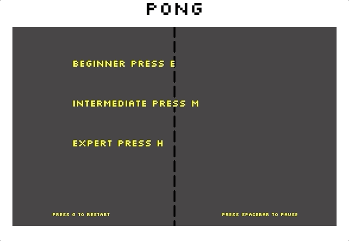
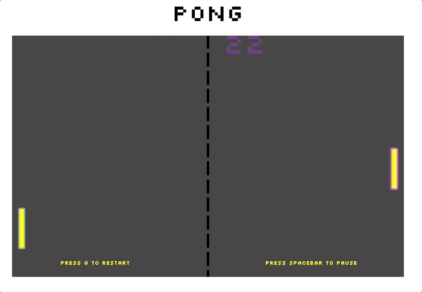
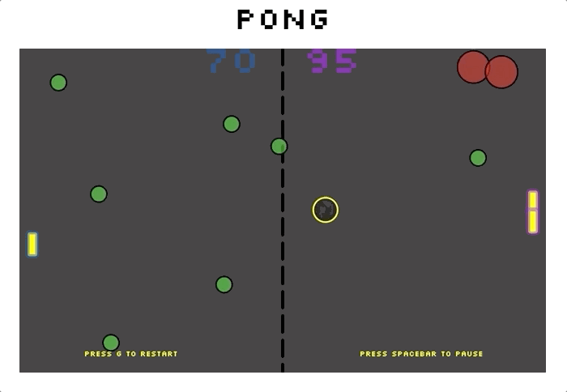

# Pong Game

A basic pong game using SVGs.

## Setup

### Install dependencies:

`> npm i`

### Run locally with Webpack Dev Server:

`> npm start`

### Build for production:

`> npm run build`

## Keys

**Player 1:**
* a: up
* z: down

**Player 2:**
* ▲: up
* ▼: down

**In game**
* g: restart game
* spaceBar: pause game

**Difficalty**
* e: easy mode
* m: intermedian mode
* h: hard mode

**Number of Players**
* s: single player
* t: two palyers
* d: demo // two computer player

**Position**
* l: left
* r: right


## Start and End Page
Add a start page that user can choose difficalty of the game and how many players are playing followed by the choice of position (left or right) in the board.

Add an end page to delcare the winner and losser by the locate the "winner" and "losser" in the coresponding side of the board

After that press g to restart the game

### problem - solved
Problem with the restarting game is the need that game loop keeps running. And a seperate class StartGame was created to draw the svgs.

### Improve
Could add a start button and the stop button in side HTML and outside the game

## Game Function
There will be two special balls (red balls and green balls) during the game, with zero or one or two AI players, fixed the bug of moving paddle when pause the game, the paddle for the player will be shorter and the ball will be acceleration every time score a goal.

### Difficulty
Basically every function in the game is based on the difficulty selected at the beginning of the game. the more difficult the game the more functions, for example, different number of special balls and the higher acceleration rate and its will change based on the scores

### Special Balls
Red Ball and GreenBall are the child class of Ball. They have the properties of the parent class and have their own property and function. Hit Red ball will add 10 points to other player and hit Green Ball will add 5 points to self.Special Balls will be sprawn based on the rounds played.

### Shorter Paddle
Everytime the play scores the paddle will shorten by certain percentage based on the difficulty

### acceleration
The ball acceleration will change everytime scores and the rate will change based on the speed of the ball.

### Improvement
can add a time intervel to sprawn the balls.

##  Final Problem and Improvement - Solved
The loops in the index.js is too complecated and need to be simplified. and the game object in side the StartPage loop only because it need to get the property and data from the user. and will stops when the main game starts.

Need to improve the code efficency and need a start and stop button

```
const startBtn = document.getElementById('start-anim');
const stopBtn = document.getElementById('stop-anim');

startBtn.addEventListener('click', startAnim);
stopBtn.addEventListener('click', stopAnimation);

let continueAnimating;

function startAnim(){
   continueAnimating = true;
    animate();
  startBtn.style.display = 'none';
}


function animate()
{
    if(continueAnimating)
    {
      console.log('animating')
        // when continueAnimating is false, this new
        // request will not occur and animation stops
        requestAnimationFrame(animate); 
    }
}

// animate();

// To turn off animation
function stopAnimation(){
  continueAnimating = false;
  console.log('stopped');
  startBtn.style.display = 'block';
}

```

## Warning - solved - no need to be worried
Because of that (getting value from the user and loop creating the game object )running the game in a **GOOD** computer!!!! Otherwise it will crush. But will be **stop** after the main game start.


## Revised Version
Fixed the problem of creating a new game object so many time that potentially breaks the browser by adding a start button.

Also the cancel the keydown event listener after starting the game to avoid protential conflick.

## Some Screenshot
```
Game difficulty: hard;
Player: AI-paddles;
```

### 1. Start-game


### 2. Mid-game


### 3. End-game

